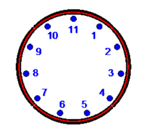
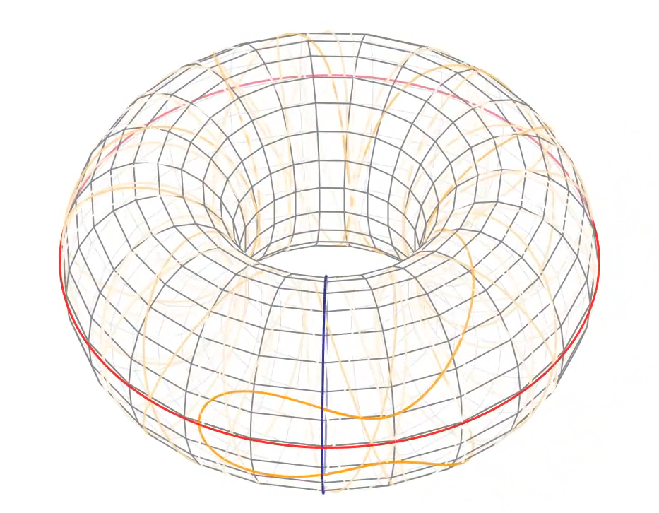
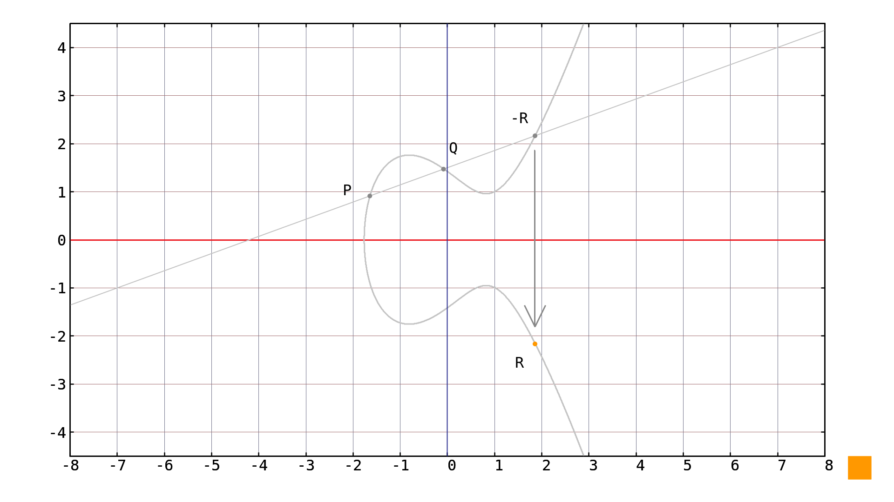
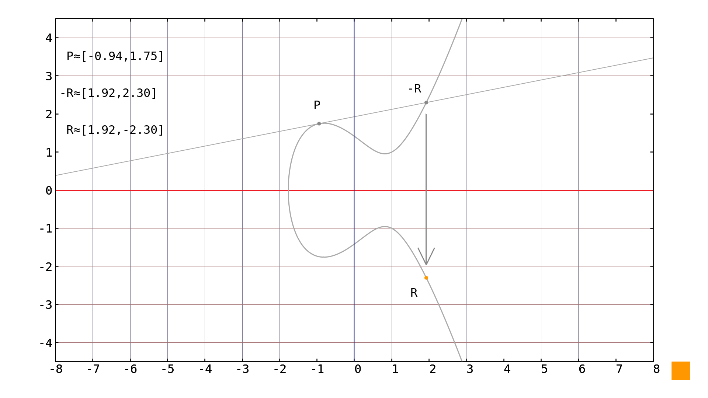
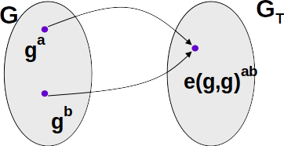

# Pairing crypto

## Resources:

### Software:
- Get rust at:
[www.rust-lang.org](https://www.rust-lang.org)
- Get jupyter notebook directly at [jupyter.org](https://www.jupyter.org) or through anaconda distribution at [anaconda.com](https://www.anaconda.com) 
- get rust jupyter kernel at [https://github.com/google/evcxr/blob/master/evcxr_jupyter/README.md](https://github.com/google/evcxr/blob/master/evcxr_jupyter/README.md) or run the code normally

### Pairings:

- Theory on pairings
[Dan Boneh Talk - Pairings in Cryptography](https://www.youtube.com/watch?v=8WDOpzxpnTE)

- Rust pairing library
[pairing](https://crates.io/crates/pairing)

- Rust threshold signatures with pairings
[threshold_crypto](https://crates.io/crates/threshold_crypto)

# Preliminaries

## Group

Group:

$$\text{Set + Operation}$$

for example:

(Integers + Addition), (Integers + Multiplication), (Elliptic curve points, point addition)

## Modular arithmetic



$$9 + 8 = 6 \ \text{in}\ \mathbb{Z}_{11}$$

## Elliptic curves

[More detailed information](https://www.youtube.com/watch?v=mFVKuFZ29Fc&list=PLN9KZDpNfsHMd7d7PX87JGesGY_Qzyb3V&index=2)

### Elliptic curves



Elliptic curve:

$$ y^2 = x^3 + ax + b$$

Elliptic curve point:

$$g = (x,y)$$

### Point addition

- take secant of p and q
- invert intersection with elliptic curve



$$ p + q = r$$

### Point doubling

- take tangent at point p
- invert intersection with elliptic curve



$$p + p = r$$

### Exponentiation

- exponentiation means multiple applications of the group operation

$$g^a \rightarrow g + g\ ...\ \text{a-times}$$

- not to be confused with exponentiation for integers, which is the same only if group operation is multiplication

# Pairings

## Symmetric pairings



Definition: A pairing is a map $e:G\times G \rightarrow G_T$ which is:

1. Bilinear: 

$$e(g^a,g^b) = e(g,g)^{ab}$$

1. Polynomialtime computable and non-degenerate

## Asymmetric pairings

Definition: A pairing is a map $e:G_1\times G_2 \rightarrow G_T$ which is:

1. Bilinear: 

$$e(g_1^a,g_2^b) = e(g_1,g_2)^{ab}$$

1. Polynomialtime computable and non-degenerate


```Rust
:dep rand = "0.4.6"
:dep bn = "0.4.3"
:dep sha2 = "0.8.0"
```


```Rust
extern crate rand;
extern crate bn;
extern crate sha2;

use bn::{Group, Fr, G1, G2, pairing};

use sha2::{Sha512, Digest};

let mut rng = rand::thread_rng();
```


```Rust
let a = Fr::random(&mut rng);

let b = Fr::random(&mut rng);

(pairing(G1::one()*a,G2::one()*b) == pairing(G1::one(),G2::one()).pow(a*b))
```


    true


# Boneh-Lynn-Shacham signature scheme

- private key $p$ is random integer from $\mathbb{Z}_r$

$$ p \leftarrow \mathbb{Z}_r$$

- public key $P$ is $G_1$ curve point

$$ P = g_1^p$$

- hash message to $G_2$ curve point, [secure way](https://medium.com/cryptoadvance/bls-signatures-better-than-schnorr-5a7fe30ea716)

$$ H(m) \in G_2$$

- signature

$$S = H(m)^p$$

- verify

$$e(g_1,S) \overset{?}{=} e(P,H(m))$$

- is equal to
$$e(g_1,H(m)^p) \overset{?}{=} e(g_1^p,H(m))$$


```Rust
//create random private key
let p = Fr::random(&mut rng);

//create corresponding public key
let P = G1::one()*p;

//hash message to G2 curve point, this is insecure version, see link in description for secure version
let mut temp: [u8;64] = [0u8;64];
let mut hasher = Sha512::new();
hasher.input("message".as_bytes());
temp.copy_from_slice(hasher.result().as_slice());

let H = G2::one()*Fr::interpret(&temp);

//create signature from Hash and private key
let S = H*p;

//check whether signature is valid
(pairing(G1::one(),S) == pairing(P,H))
```


    true


# Signature aggregation

- private keys $p_1,p_2$ is random integer from $\mathbb{Z}_r$

$$ p_1,p_2 \leftarrow \mathbb{Z}_r$$

- public keys $P_1,P_2$ are $G_1$ curve points

$$ P_1 = g_1^{p_1}, \qquad P_2 = g_1^{p_2}$$

- hash messages $m_1,m_2$ to $G_2$ curve points, [secure way](https://medium.com/cryptoadvance/bls-signatures-better-than-schnorr-5a7fe30ea716)

$$ H(m_1),H(m_2) \in G_2$$

- signatures

$$S_1 = H(m_1)^{p_1}, \qquad S_2 = H(m_2)^{p_2}$$

- aggregate signature

$$ S = S_1 + S_2$$

- verify

$$e(g_1,S) \overset{?}{=} e(P_1,H(m_1)) e(P_2,H(m_2))$$

- is equal to
$$e(g_1,H(m_1)^{p_1} + H(m_2)^{p_2}) = e(g_1,H(m_1)^{p_1}) e(g_1, H(m_2)^{p_2}) \overset{?}{=} e(g_1^{p_1},H(m_1))e(g_1^{p_2},H(m_2))$$


```Rust
//create random private keys
let p1 = Fr::random(&mut rng);
let p2 = Fr::random(&mut rng);

//create corresponding public keys
let P1 = G1::one()*p1;
let P2 = G1::one()*p2;

//hash messages to G2 curve points, this is insecure version, see link in description for secure version
let mut temp: [u8;64] = [0u8;64];
let mut hasher = Sha512::new();
hasher.input("message1".as_bytes());
temp.copy_from_slice(hasher.result().as_slice());

let H1 = G2::one()*Fr::interpret(&temp);

let mut hasher = Sha512::new();
hasher.input("message2".as_bytes());
temp.copy_from_slice(hasher.result().as_slice());

let H2 = G2::one()*Fr::interpret(&temp);

//create signature from Hashes and private keys
let S1 = H1*p1;
let S2 = H2*p2;

//aggregate signatures
let S = S1 + S2;

//check whether signature is valid
(pairing(G1::one(),S) == pairing(P1,H1)*pairing(P2,H2))
```


    true


